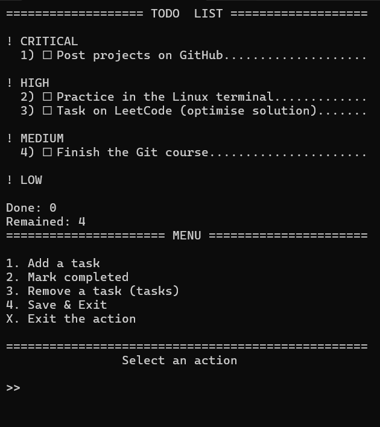

# TODO list

## Description

A simple command-line task manager written in Python. The application allows users to create, manage, prioritize, and track tasks with persistent JSON storage.

---

## Demo



---

## Features

- Add and delete tasks
- Mark tasks as completed
- Set priority levels for tasks
- Automatically group tasks by priority
- Store tasks locally between sessions
- Validate user input and handle errors

---

## Technologies

- Python 3
- JSON — for storing and loading task data
- `textwrap` — for formatting long text and wrapping lines
- `os` — for clearing the console screen and improving user interface

---

## Project Structure
``` text
TODO-list/
│
├── README.md
├── main.py
├── task_manager.py
├── storage.py
├── images/
│   └── preview.png
└── .gitignore
```
---

## Installation

1. Clone the repository:
``` bash
git clone git@github.com:ss29enter/TODO-list.git
```
2. Navigate to the project folder:
``` bash
cd TODO-list
```
3. Run the program:
``` bash
python main.py
```
---

## Usage

* Creating a new task:

```text
Task: Finish Todo List project
Priority level [1-4]: 1
```
Task list:

```text
! CRITICAL
  2) ☐ Finish Todo List project

! HIGH
  1) ☐ Continue learning Python
```
* Mark the task as comleted:

```text
Enter the number: 2
```
Task list:

```text
! CRITICAL
  2) ☒ Finish Todo List project

! HIGH
  1) ☐ Continue learning Python
```
---

## What I Learned

- Working with JSON files
- Managing structured data with dictionaries
- Handling user input and errors
- Organizing code into functions
- Creating a command-line application

---

## Future Improvements

- Add task editing
- Add deadlines
- Add task categories

---

## License

This project is licensed under the MIT License. See the [LICENSE](LICENSE) file for details.